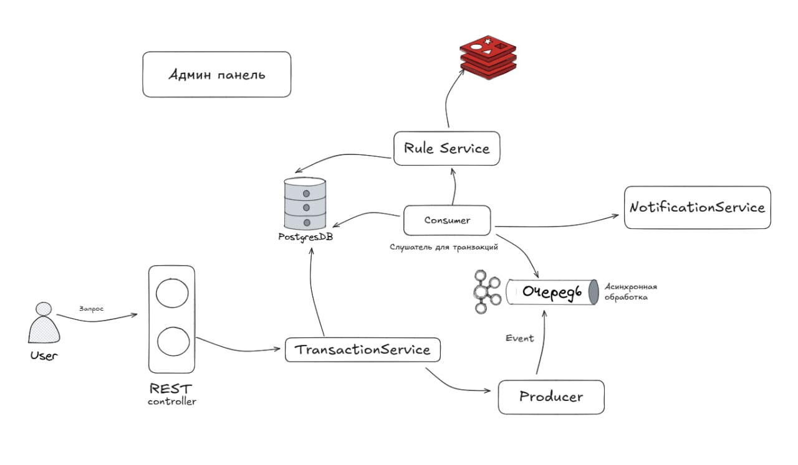

## Архитектура приложения


## Используемые технологии

- **Java 17**

- **Spring Boot**  
  Фреймворк для построения веб-приложений и микросервисов.

- **Spring Data JPA и PostgreSQL**  
  Управление персистентностью данных и хранение в реляционной базе PostgreSQL.

- **Spring Kafka**  
  Асинхронное взаимодействие и обмен сообщениями с помощью Apache Kafka.

- **Redis с Redis Stack**  
  Кэширование данных и быстрый доступ к данным в памяти.

- **Liquibase**  
  Миграции базы данных и управление версиями схем.

- **MapStruct**  
  Генерация мапперов для преобразования DTO и сущностей.

- **Apache Avro и Schema Registry**  
  Схемирование и сериализация данных в Kafka.

- **Micrometer с Prometheus**  
  Мониторинг метрик приложения.

- **Grafana и Loki**  
  Визуализация метрик и сбор логов.

- **Gradle Kotlin DSL**  
  Система сборки с использованием Kotlin скриптов.

- **Docker и Docker Compose**  
  Контейнеризация сервисов и организация их запуска.

- **Thymeleaf**  
  Шаблонизатор для админ-панели.

## Как запустить?
1. Клонировать репозиторий
```Java
  git clone git@git.codenrock.com:it-one-cup-code-analyst-1568/cnrprod1760719343-team-89219/repozitorij-dlya-raboty-7408.git
```

2. Собрать проект с помощью Gradle
```
  build gradle
```
3. Поднять Docker командой
```  
  docker-compose up
```

4. Доступ осуществляется локально
Админ панель
```
  localhost:8080/admin/dashboard
```
Метрики (Grafana)
```
  localhost:3030
```
Логин/пароль от Grafana стандартный: admin/admin
